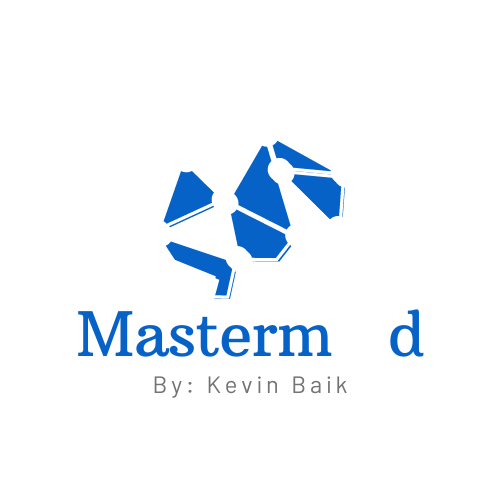
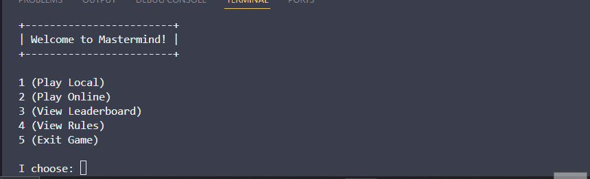
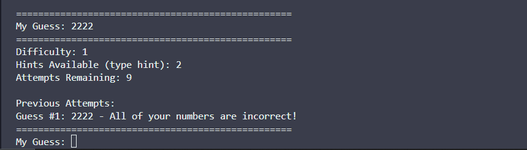
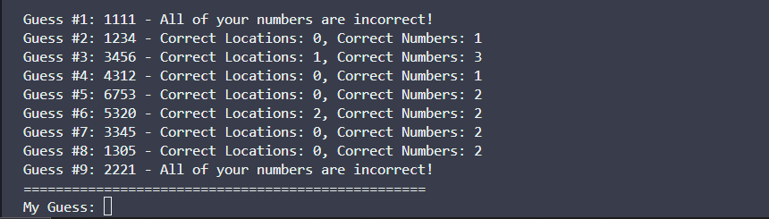
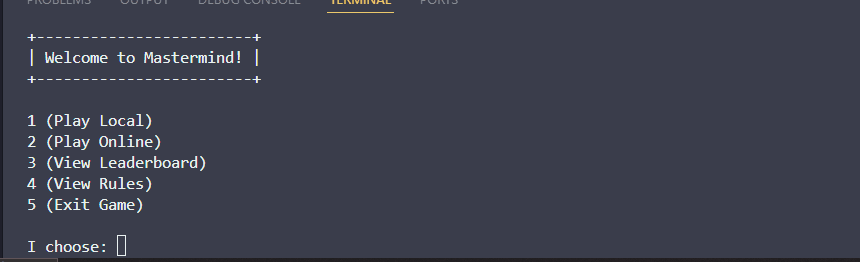
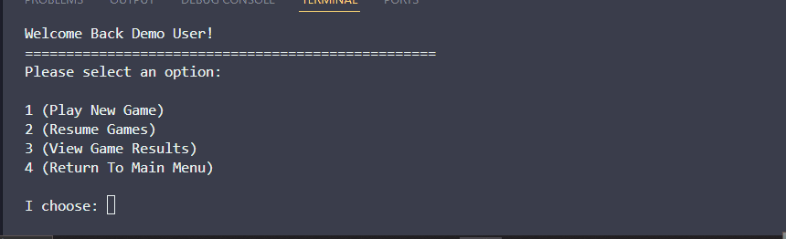
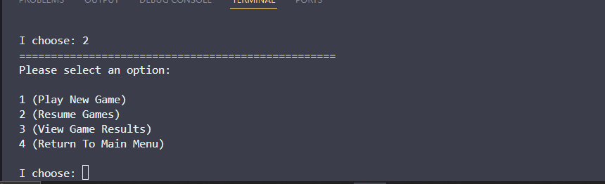
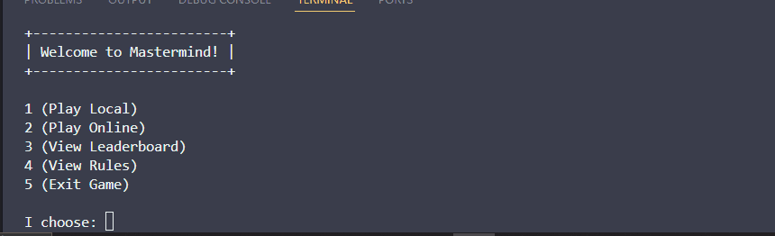
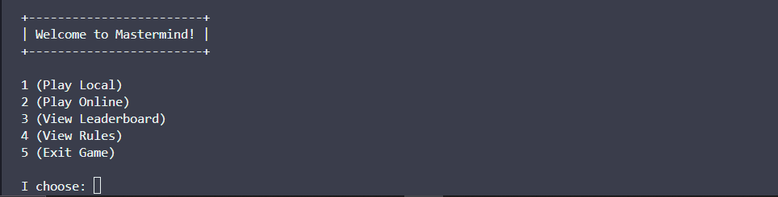

# Welcome to Mastermind! 
<div align="center">  </div>

## 📚 Table of Contents 📚
- [Introduction](#-introduction-)
- [Setup and Run](#-setup-and-run-)
- [Demo Walkthrough](#-demo-walkthrough-)
- [Features](#-features-)
- [Future Implementations](#-future-implementations-)
- [API Documentation](#-api-documentation-)
- [My Journal](#-my-journal-)
- [Contact](#contact-)
  
## 🧠 Introduction 🧠
Mastermind is a console-based puzzle game where players decipher a secret code. Play it offline for a straightforward challenge or connect online to access extra features like saving your progress. 
<br><br>
Whether you're looking for a quick mental workout or a fun way to pass the time... Mastermind provides a unique to test your deductive skills! 

## 💻 Setup and Run 💻

Prerequisites:
   - **Python 3.12**: You may download and install Python 3.12 from [python.org](https://www.python.org/downloads/release/python-3120/)
   - **Pip**: Pip is automatically installed with Python 3.12, but you can ensure it is up to date by following the instructions [here](https://pip.pypa.io/en/stable/installation/).
     
### 1.  Clone Repo:
```bash
git clone https://github.com/kevindbaik/Mastermind_KB.git
```
### 2. Navigate to Project Directory:
```bash
cd Mastermind_KB
```
### 3. Environment Setup:
If you do NOT have 'pipenv' installed, run one of the following commands:
```bash
pip install pipenv

    or 

pip3 install pipenv
```

After installing `pipenv`, run this command to create a virtual environment and install all required dependencies (including Flask):

```bash
pipenv install
```

### 4. Database Setup
Mastermind includes two pre-seeded SQLite database files located in the 'db' directory. If they are missing or need to be reset, navigate to the 'db' directory and run the setup scripts:
```bash
cd db
python local_setup.py
python online_setup.py
```

### 5. Starting Server:
To play in online mode, Mastermind requires the Flask server running on port 5000. Open a second terminal and navigate to the 'server' directory:
```bash
cd server
```
Start the Flask server by running:
```bash
pipenv run flask run
```

### 6. Running Mastermind
To start the game, from the root directory of Mastermind run:
```bash
python main.py
```

## 🎦 Demo Walkthrough 🎦
### Local Play
- You can play Mastermind with no internet connection through the (Play Local) option!
- All scores played in local mode are saved in the local leaderboard. <br><br>
 <br><br>
- 🐣🎉 Winner! Winner! Chicken Dinner! 🎉🐣 <br><br>
 <br><br>
- 👍❌ Aww.. dont worry, you'll get it next time! ❌👍 <br><br>
 <br><br>

### Online Play
- If you have an internet connection and the Flask server running, you can play Mastermind Online!
- Register an account or login using the demo user credentials (demouser@demo.com, demouser)
  - Once you log in, you will not be asked to login again until you exit the game. <br><br>
 <br><br>

- You can start a new game or continue one of your games in progress!
- During a game session, you may enter 'return' to return back to the menu. <br><br>
 <br><br>
- You can also view the results of your past games!  <br><br>
 <br><br>

### Leaderboard
- View the top 10 players with the highest scores both locally and online! <br><br>
 <br><br>

### Rules
- The rules of Mastermind are always accessible to read in the main menu! <br><br>
 <br><br>


## 🏁 Features 🏁
  - Play the game in three different ways:
    - Through terminal with no internet connection (local mode).
    - Through terminal with internet connection (online mode).
    - Through HTTP requests via Postman or any other HTTP client.
  - Difficulty option that effects game code.
  - Use two available hints in each game. 
  - Total score calculation on victory that stores into leaderboard.
  - Create an account with a name, email, and password for online mode.
    - Once logged in, session is saved and user will not have to re login. 
  - Online game progress is always saved.
  - Jump back in to any of your online games in session and even play multiple games.
  - View results of past online games.
  - View both local and online leaderboards.
<br><br>
## 🔜 Future Implementations 🔜
  - View leaderboard rankings by seperate difficulties.
  - Play local multiplayer.
  - Cancel an online game in session.
  - Game timer that tracks each game completed. 
<br><br>
## 🔨 API Documentation 🔨
**_Click [here](/readme/api-reference.md) for more information about the API routes and database schema!_**
<br><br>
## ✍🏻 My Journal ✍🏻
**_Click [here](/readme/journal.md) to see my daily progress and feelings throughout the 1-week development cycle!_**
<br><br>
## Contact 🧑🏻
If you have any questions or feedback for me, I'd love hear it! Please don't hesitate to reach out at:
- **Email**: [kevindbaik@gmail.com](mailto:your.email@example.com)
- **LinkedIn**: [Kevin Baik](https://www.linkedin.com/in/kevin-baik-311438193/)
- **GitHub**: [@kevindbaik](https://github.com/kevindbaik)
